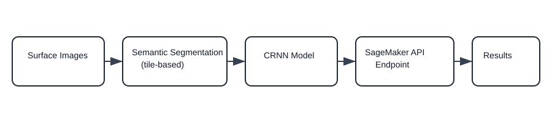
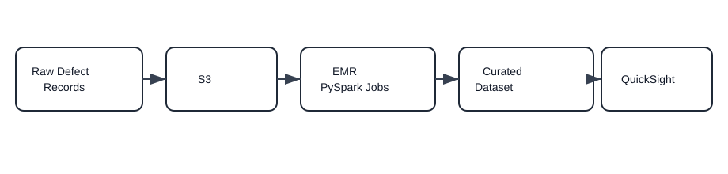
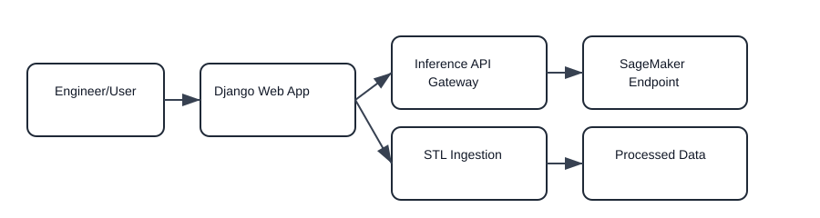

# BMW Group Data Science Internship Report

## Title Page

**Report Title:** Data Science Internship Report – BMW Group (Forming Simulation & Engineering Methods)  
**Student:** Morris Darren Babu  
**Matriculation Number:** 23206441  
**Program:** M.Sc. Data Science, FAU Erlangen–Nürnberg  
**Company:** Bayerische Motoren Werke Aktiengesellschaft (BMW Group)  
**Department/Team:** Umformsimulations-, Engineeringmethoden (Forming Simulation & Engineering Methods)  
**Location:** Munich, Germany (FIZ – Research & Innovation Center)  
**Internship Period:** 14 October 2024 – 11 April 2025  
**Supervision:** Dr. Janne Strauß‑Ehrl (Head of Department), Dr. Kerim Isik (Specialist)  

---

## Table of Contents

1. Executive Summary  
2. Introduction and Context  
3. Company and Team Overview  
4. Internship Objectives and Scope  
5. Internship Timeline  
6. Daily Workflow and Responsibilities  
7. Project Work and Technical Contributions  
   - CRNN Deployment & False‑Positive Reduction  
   - LLM RAG System for Internal Documentation  
   - PySpark Pipeline Optimization for Defect Data  
   - Django Web Application & STL Ingestion  
   - Automation and GNN‑Related Support  
8. Methods, Tools, and Data Workflow  
9. Evaluation and Validation Approach  
10. Challenges and Mitigation  
11. Data Governance and Documentation Standards  
12. Collaboration and Communication  
13. Results, Outputs, and Impact  
14. Skills Gained and Reflection  
15. Future Work and Recommendations  
16. Module Requirement Mapping  
17. Conclusion and Approval Request  
18. Attachments  

---

## Executive Summary

This report covers my six‑month data‑science internship at BMW Group in the Forming Simulation & Engineering
Methods department in Munich (14 October 2024 to 11 April 2025). The placement exceeded the required duration and
remained fully aligned with data‑science learning objectives. My work focused on applied machine learning, data
engineering, model evaluation, and deployment tasks that supported manufacturing quality and engineering teams.

Key contributions included deploying a Convolutional Recurrent Neural Network (CRNN) surface‑detection model on
AWS SageMaker, creating a semantic‑segmentation pre‑processing pipeline to reduce false positives, building a
retrieval‑augmented generation (RAG) workflow for internal documentation with prompt and parameter tuning,
optimizing PySpark pipelines on AWS EMR for surface‑defect data and QuickSight dashboards, and developing a Django
web application for model inference and STL mesh ingestion. These outcomes improved model precision, reduced
manual inspection effort, and provided scalable, user‑friendly tools for engineers.

---

## Introduction and Context

Surface quality in manufacturing is a critical factor for customer satisfaction, safety, and cost control. Even
small scratches or defects can lead to product rework, material waste, or delayed delivery. The department’s
mission is to reduce these risks by combining simulation and data‑science‑driven inspection methods. My
internship contributed to this goal through targeted improvements in model deployment, data processing, and
knowledge retrieval systems.

The work was shaped by practical constraints: compute resources were limited for large‑scale retraining, data
was heterogeneous, and results needed to be interpretable for engineering stakeholders. These constraints made it
important to prioritize robust, production‑friendly solutions rather than experimental approaches alone. My role
focused on bridging those constraints by delivering applied, measurable improvements while also maintaining
research‑level rigor.

On a personal level, I aimed to connect technical outputs with practical decisions on the shop‑floor side of the
organization. That meant translating model performance into insights that engineers could trust and act on.

---

## Company and Team Overview

BMW Group is a global automotive manufacturer with a strong commitment to digitalization, simulation‑based
engineering, and AI‑enabled quality assurance. The Research and Innovation Center (FIZ) in Munich brings together
engineering, simulation, and data‑science specialists to accelerate development cycles and raise manufacturing
quality standards.

I worked in the **Forming Simulation & Engineering Methods** department. This team focuses on:

- AI‑driven surface inspection and defect detection.
- Data pipelines for manufacturing‑relevant datasets.
- Evaluation of emerging AI/LLM solutions for engineering knowledge.
- Practical tools that allow engineers to access model outputs efficiently.

My work was closely aligned with these priorities, combining deployment‑oriented engineering with data‑science
experimentation and evaluation.

---

## Internship Objectives and Scope

The internship objectives were framed around improving AI‑based surface analysis and enabling scalable data
workflows. Key objectives included:

1. Deploying and validating an existing CRNN model for surface‑scratch detection in a production‑oriented
   environment.
2. Reducing false positives through semantic segmentation and careful parameter tuning.
3. Building a knowledge‑retrieval workflow using LLMs (RAG and vector search) for internal documentation.
4. Optimizing data processing pipelines for defect records and enabling reporting dashboards.
5. Developing a stable web‑based interface for model inference and STL mesh ingestion.
6. Supporting automation tasks and assisting a PhD researcher with graph‑neural‑network (GNN) workflows.

These objectives ensured that my tasks remained data‑science focused while still addressing real engineering
needs.

---

## Internship Timeline

The following timeline summarizes the progression of the internship and highlights major milestones.

---

**Text fallback (timeline summary):**

| Period | Focus |
| --- | --- |
| Oct–Nov | CRNN model review and baseline evaluation |
| Dec | Segmentation pipeline and API deployment |
| Jan–Feb | RAG workflow design, tuning, and evaluation |
| Mar | EMR pipeline optimization and Django prototype |
| Apr | Final reporting, documentation, and handoff |

---

## Daily Workflow and Responsibilities

My week typically blended two modes of work. In one mode, I ran experiments and evaluations (model inference,
error analysis, and prompt tuning). In the other, I focused on engineering deliverables such as pipeline updates,
deployment steps, and documentation. This combination kept progress visible to stakeholders while allowing time
for deeper analysis.

I kept short task logs, shared results in regular check‑ins, and adjusted priorities based on feedback from
engineers and supervisors. This rhythm helped me deliver incremental improvements rather than only end‑of‑project
outputs.

---

## Project Work and Technical Contributions

### 1) CRNN Surface‑Analysis Model Deployment & False‑Positive Reduction

**Background:** The team maintained a CRNN model (initially developed by a PhD candidate) for scratch detection on
surface images. While accurate on standard cases, the model produced false positives on a subset of edge cases,
which reduced trust in results and increased manual verification effort.

**Key work I performed:**

- **Model exploration and evaluation:** I examined the CRNN architecture, parameter settings, and inference
  outputs to identify patterns that triggered false positives. This exploratory analysis allowed me to classify
  which surface textures and lighting conditions were most problematic.
- **AWS deployment:** I deployed the CRNN model on **AWS SageMaker** with model artifacts stored in **S3** and a
  production‑style inference endpoint exposed through a REST‑style API. This deployment allowed engineers to test
  the model in a consistent environment and evaluate latency.
- **Edge‑case retraining attempt:** I experimented with retraining on a basic Ubuntu machine but confirmed that the
  cost and time were not justified for the targeted edge cases.
- **Semantic segmentation pipeline:** Instead of heavy retraining, I introduced a **semantic‑segmentation
  pre‑processing pipeline**. The pipeline divided large surface images into smaller tiles, allowing the CRNN to
  focus on localized regions and reducing noise from non‑relevant areas. This approach reduced false positives
  without altering the core model.
- **Parameter tuning:** I adjusted inference thresholds and model parameters to align with the segmentation
  output and maintained detection sensitivity.

To validate the approach, I curated a small internal evaluation set covering typical surfaces and known edge
cases. I compared outputs before and after segmentation, documenting which tile sizes and thresholds offered the
best balance between sensitivity and false‑positive reduction. The tiled outputs also made it easier for
engineers to interpret why a detection was triggered and to provide feedback for future improvements.

**Outcome:** The CRNN model was successfully deployed and served through an API endpoint. The segmentation
pipeline reduced false positives for edge cases and enabled more reliable usage by engineers.

**Surface Analysis Pipeline (rendered diagram):**

*Text fallback:* Surface images → Semantic segmentation (tile‑based) → CRNN model → SageMaker API endpoint → Results & QA feedback.

---

### 2) LLM RAG System for Internal Documentation

**Background:** The team experimented with an internal LLM‑based assistant to retrieve information from technical
and process documentation. Early work was done locally; during the internship, **GAIA** was introduced with an
application framework that could host LLM workflows more systematically.

**Key work I performed:**

- **RAG workflow design:** I designed a retrieval‑augmented generation (RAG) pipeline using document chunking,
  embeddings, and vector search. Chunking rules were tuned to balance context coverage and retrieval efficiency.
- **Indexing and evaluation:** I prepared internal documents, cleaned and structured them, and created an index
  for semantic retrieval. I also prepared question sets to evaluate accuracy and relevance of responses.
- **Prompt and parameter optimization:** Initial results were inconsistent. I iteratively refined prompts and
  tuned parameters such as **top‑p** and **top‑k**, while testing different model configurations to maximize
  retrieval accuracy and response clarity.
- **Precision improvement:** The tuning process improved precision by **12%** on internal validation queries.

When GAIA became available, I migrated the pipeline into the platform so the evaluation cycle could be repeated
consistently. I logged query examples, categorized failure cases (missing context, vague responses, or incorrect
citations), and updated prompts and chunking rules to address each category in a targeted way.

**Outcome:** The RAG workflow provided a structured and repeatable approach to internal knowledge retrieval. The
prompt‑engineering work demonstrated that careful tuning can materially improve precision for engineering
questions.

**RAG Workflow (rendered diagram):**

*Text fallback:* Internal documents → Chunking & cleaning → Embedding generation → Vector index; user query → Retriever → Context assembly → LLM response.

---

### 3) PySpark Pipeline Optimization for Defect Data

**Background:** Manufacturing defect records were collected from multiple sources and required consistent
processing to support reporting and analytics. The existing pipeline needed improved scalability and data
normalization.

**Key work I performed:**

- **PySpark optimization on AWS EMR:** I optimized distributed jobs for surface‑defect data processing, focusing
  on efficient transformations and consistent outputs.
- **Schema restructuring:** I refined schemas and standardized defect categories to improve downstream reporting
  and reduce manual cleanup.
- **Integration of new defect records:** Additional records were integrated into the pipeline to improve data
  completeness and coverage.
- **QuickSight dashboard readiness:** Outputs were formatted to meet **AWS QuickSight** requirements, enabling
  easier visualization for stakeholders.

I also reviewed partitioning strategies and reduced shuffle overhead for the largest joins. Lightweight
data‑quality checks were added before publishing curated datasets so that dashboards could be refreshed with
higher confidence and less manual cleanup.

**Outcome:** The optimized pipeline improved data consistency and readiness for analytics, strengthening the
reporting foundation for manufacturing quality.

**Defect Data Pipeline (rendered diagram):**

*Text fallback:* Raw defect records → S3 landing zone → EMR PySpark jobs → Curated dataset → QuickSight dashboards.

---

### 4) Django Web Application for Model Inference & STL Ingestion

**Background:** Engineers needed a reliable interface to use the CRNN model and ingest STL mesh files. Early
prototypes using lightweight frameworks struggled with stability under heavy inference workloads.

**Key work I performed:**

- **Framework evaluation:** I tested **Gradio**, **Streamlit**, and **Flask**, but encountered timeout and
  memory‑consumption issues when inference was slow or payloads were large.
- **Django selection:** Django consistently handled longer inference durations and heavier loads more reliably.
- **Prototype implementation:** I built a **Django web interface** with usability features, including clear status
  indicators, structured result views, and input validation for file uploads.
- **STL ingestion optimization:** The application supported STL mesh ingestion using document‑chunking pipelines,
  improving processing time by **8%**.

In addition to the core UI, I added consistent naming conventions for uploads, clearer progress messaging, and
error‑handling flows for large files. These usability details were important for engineers who needed to compare
multiple inference runs and share results within the team.

**Outcome:** A stable web prototype enabled engineers to interact with the model in a predictable way and created
an extensible base for future deployment.

**Web Application Architecture (rendered diagram):**

*Text fallback:* Engineer/User → Django web interface → (Inference API → SageMaker endpoint → Results) and (STL ingestion → Processed data).

---

### 5) Automation Tasks and GNN‑Related Support

In addition to the main projects, I supported the team with automation and research‑related assistance:

- **Automation tasks:** I scripted repetitive data‑handling and reporting steps that reduced manual effort and
  improved reliability for routine workflows.
- **PhD support (GNN):** I assisted a PhD researcher with data preparation and automation tasks for
  graph‑neural‑network experiments.
- **Exploratory GNN work:** I continued personal learning on GNN methods to improve my ability to support
  graph‑structured data tasks.

The automation support reduced turnaround time on routine tasks and helped the team focus on analysis rather than
repetitive preparation. It also made collaboration with the PhD researcher smoother because data‑handling steps
were documented and easier to reproduce.

These contributions helped the team maintain momentum on parallel research tasks while I focused on the core
internship projects.

---

## Methods, Tools, and Data Workflow

The work combined research‑style evaluation with production‑style engineering. I prioritized methods that were
repeatable, measurable, and explainable to stakeholders, while keeping solutions lightweight enough for the
available infrastructure.

### Methods

- Machine‑learning model evaluation and validation for a CRNN surface‑analysis model.
- Semantic segmentation as a pre‑processing strategy to reduce false positives.
- Retrieval‑augmented generation (RAG) using embeddings, vector search, and chunking.
- Prompt engineering with parameter tuning (top‑p, top‑k, and model selection).
- Scalable data processing and schema normalization using PySpark.
- Web‑application engineering for inference and STL ingestion.

### Tools and Technology Stack

- **AWS:** SageMaker, S3, EMR, QuickSight
- **Data Processing:** PySpark
- **Application Development:** Django, REST‑style APIs
- **ML/AI Workflows:** CRNN, semantic segmentation pipeline, RAG, vector search
- **General:** Python, Linux/Ubuntu environment

### Data Sources

- Surface image datasets for scratch detection.
- Manufacturing defect records and quality‑control datasets.
- STL geometric meshes for engineering data ingestion.
- Internal documentation for LLM knowledge retrieval.

### Workflow Overview

1. **Data ingestion** into S3 or local processing environments.
2. **Pre‑processing and structuring** (segmentation, chunking, schema normalization).
3. **Model inference/evaluation** for CRNN and LLM pipelines.
4. **Pipeline optimization** for scalable defect‑data processing.
5. **Delivery to stakeholders** through web interfaces and dashboards.

---

## Evaluation and Validation Approach

To keep the work grounded in measurable results, I used lightweight but consistent evaluation methods across
projects. For the CRNN model, I compared inference outputs across baseline and segmented inputs, focusing on
edge‑case images that previously caused false positives. For the RAG workflow, I built a small question catalog
that represented common engineering queries and evaluated answers against expected references from the
documentation.

Where possible, I combined quantitative indicators (precision improvement, faster ingestion times) with
qualitative feedback from engineers who reviewed outputs. This mixed evaluation approach ensured that models were
not only accurate in a technical sense but also useful in daily engineering practice.

---

## Challenges and Mitigation

Several challenges shaped the approach I took during the internship:

- **Compute limits for retraining:** Edge‑case retraining was costly on available hardware. I addressed this by
  introducing a segmentation pre‑processing pipeline that reduced false positives without requiring extensive
  retraining.
- **Model latency and stability:** Lightweight frameworks struggled with inference timeouts. I mitigated this by
  selecting Django for the production‑style prototype, which offered greater stability under load.
- **LLM accuracy gaps:** Early RAG experiments produced inconsistent responses. Systematic prompt tuning,
  parameter adjustments, and structured evaluation improved precision by 12%.
- **Data heterogeneity:** Defect data came from multiple sources with inconsistent schemas. I normalized fields
  and refactored the pipeline to support consistent reporting.

These mitigation steps prioritized practical reliability while keeping solutions within realistic compute and
resource limits.

---

## Data Governance and Documentation Standards

All work was conducted with respect for internal confidentiality and engineering documentation standards. I
focused on producing reproducible outputs and keeping technical notes clear enough for handoff to future interns
or team members. Where data sensitivity applied, I worked only with approved datasets and documented assumptions
so that results could be reviewed without exposing proprietary details.

---

## Collaboration and Communication

A core part of the internship involved working with engineering stakeholders and researchers. I regularly aligned
requirements with supervisors, documented findings, and communicated trade‑offs in simple terms so that non‑data‑
science colleagues could act on results. This included:

- Sharing evaluation results and false‑positive cases for the CRNN model.
- Presenting RAG workflow improvements and explaining how prompt changes affected accuracy.
- Coordinating with a PhD researcher on automation tasks and data preparation for GNN experiments.

I also participated in short review meetings where we agreed on milestones and validated whether prototypes were
meeting expected quality thresholds. This rhythm helped me prioritize tasks, communicate trade‑offs, and adapt to
feedback quickly without losing progress on the larger goals.

This collaboration ensured that technical outputs were usable by engineers and aligned with departmental
priorities.

---

## Results, Outputs, and Impact

The internship delivered measurable results and usable artifacts:

- **Reduced false positives** in surface‑scratch detection by adding a segmentation pipeline before CRNN
  inference.
- **API‑based deployment** of the CRNN model on AWS SageMaker for reliable inference access.
- **12% precision improvement** for the LLM knowledge‑retrieval workflow through RAG tuning and prompt
  optimization.
- **8% faster STL ingestion** using document‑chunking pipelines in the Django prototype.
- **Optimized PySpark pipelines** that improved defect‑data reporting consistency in QuickSight.

Beyond metrics, the work improved trust in AI‑based inspection results, reduced manual verification effort, and
provided scalable infrastructure for future engineering projects.

The combination of deployment, evaluation, and interface work meant that improvements were not limited to a
single component. Each deliverable connected to the next step in the workflow, making the overall process more
cohesive for daily engineering use.

---

## Skills Gained and Reflection

This internship strengthened my ability to apply data‑science methods in an industrial setting:

- **Applied ML engineering:** I learned to deploy, test, and validate models in cloud environments instead of
  only local experiments.
- **Practical problem solving:** I prioritized segmentation and parameter tuning over expensive retraining to
  achieve measurable improvements.
- **LLM evaluation and prompt engineering:** I gained hands‑on experience building RAG workflows and measuring
  accuracy in a structured way.
- **Scalable data engineering:** Optimizing PySpark pipelines improved my ability to manage large, complex
  datasets.
- **User‑facing delivery:** Building a Django interface helped me understand how engineers interact with AI
  systems and what usability considerations matter most.

Overall, the internship confirmed my interest in applied machine learning for manufacturing and strengthened my
confidence in bridging research‑level models with production‑ready workflows.

From a personal perspective, the experience improved my ability to balance experimental ideas with practical
constraints. I learned to defend design decisions with data, communicate trade‑offs clearly, and deliver outcomes
that were immediately usable by non‑data‑science colleagues.

---

## Future Work and Recommendations

Based on the internship experience, I recommend the following next steps:

1. **Expand evaluation datasets** for CRNN and segmentation to cover more realistic manufacturing variations.
2. **Harden the Django prototype** with authentication, logging, and monitoring to prepare for internal rollout.
3. **Extend RAG evaluation** with periodic refresh cycles and automated regression tests for prompt changes.
4. **Automate pipeline observability** for EMR jobs to track failures and performance in real time.

These steps would further improve reliability and help move prototypes into stable production systems.

---

## Module Requirement Mapping

The internship fulfills module requirements as it lasted **approximately six months** and consisted of continuous
data‑science‑related tasks.

| Task | Data‑Science Relevance | Evidence |
| --- | --- | --- |
| CRNN deployment & semantic segmentation | ML deployment, inference validation, error reduction | BMW internship certificate + report details |
| RAG system with vector search | NLP, embeddings, retrieval evaluation, prompt tuning | Report + internal project documentation |
| PySpark EMR pipeline optimization | Large‑scale data processing, schema design, analytics | Report + pipeline outputs |
| Django inference & STL ingestion app | Data ingestion, API integration, applied ML tooling | Report + prototype screenshots (if required) |
| Automation & GNN support | Data prep automation, experimental ML workflows | Report narrative |

---

## Conclusion and Approval Request

My internship at BMW Group (14 October 2024 to 11 April 2025) was a continuous six‑month placement in a
specialized data‑science and engineering department. The tasks were directly related to machine learning, data
analysis, large‑scale data processing, and AI/LLM evaluation. I respectfully request that the examination
committee recognizes this internship as fulfilling the technical qualification/module requirement.

---

## Attachments

1. **Employment Reference.pdf** – BMW Group internship certificate (“Praktikumszeugnis”), including duration,
   department, and task list.
2. **2025-02-05 Immatrikulationsbescheinigung.pdf** – FAU enrollment certificate with matriculation number and
   program.
3. **Optional (if required):** anonymized screenshots/figures of the Django interface or pipeline diagrams.
