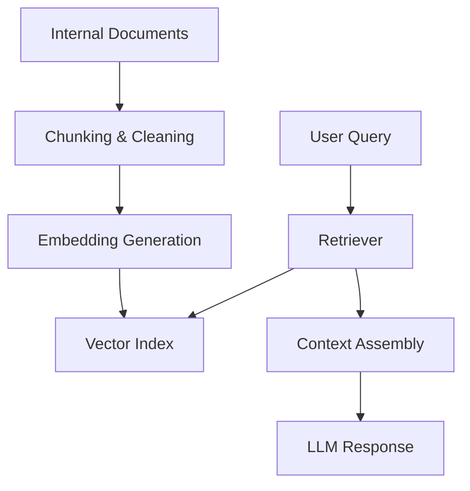
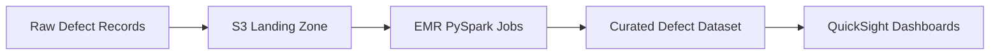
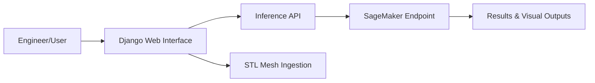

# BMW Group Data Science Internship Report

## Title Page

**Report Title:** Data Science Internship Report – BMW Group (Forming Simulation & Engineering Methods)  
**Student:** Morris Darren Babu  
**Matriculation Number:** 23206441  
**Program:** M.Sc. Data Science, FAU Erlangen–Nürnberg  
**Company:** Bayerische Motoren Werke Aktiengesellschaft (BMW Group)  
**Department/Team:** Umformsimulations-, Engineeringmethoden (Forming Simulation & Engineering Methods)  
**Location:** Munich, Germany (FIZ – Research & Innovation Center)  
**Internship Period:** 14 October 2024 – 11 April 2025  
**Supervision:** Dr. Janne Strauß‑Ehrl (Head of Department), Dr. Kerim Isik (Specialist)  

---

## Executive Summary

This report documents my six‑month data‑science internship at BMW Group in the Forming Simulation & Engineering
Methods department in Munich (14 October 2024 to 11 April 2025). The internship exceeded the minimum duration
of four weeks and was fully aligned with data‑science module requirements. My responsibilities centered on
applied machine learning, data engineering, model evaluation, and deployment for manufacturing and engineering
use cases.

Key contributions included deploying a Convolutional Recurrent Neural Network (CRNN) surface‑detection model on
AWS SageMaker, engineering a semantic‑segmentation pre‑processing pipeline to reduce false positives, building
RAG‑based LLM workflows for internal documentation with vector search and prompt optimization, optimizing PySpark
pipelines on AWS EMR for surface defect data with QuickSight reporting, and developing a Django web application for
model inference and STL mesh ingestion. The results supported improved data accessibility, increased model
precision, and more scalable workflows for engineering teams.

---

## Company and Team Overview

BMW Group is a global automotive manufacturer with a strong focus on digital transformation, data‑driven
engineering, and AI‑enabled quality assurance. The Research and Innovation Center (FIZ) in Munich brings together
engineering and data teams that develop advanced technologies for product development and manufacturing quality.

I worked in the **Forming Simulation & Engineering Methods** department. This team supports manufacturing
engineering through simulation, applied data analytics, and AI‑assisted inspection of component surfaces. The
department’s focus includes:

- Improving surface inspection workflows using machine learning.
- Supporting manufacturing data pipelines and analytics.
- Evaluating emerging AI/LLM capabilities for engineering knowledge systems.
- Building practical tools that allow engineers to access AI results efficiently.

My internship aligned directly with these priorities through model deployment, data workflow optimization, and
application prototyping.

---

## Internship Objectives and Scope

The internship objectives were defined around enabling data‑driven engineering decisions and improving the
scalability of AI workflows for surface analysis. The scope included:

1. Deploying and validating an existing CRNN model for surface scratch detection in a production‑oriented
   environment.
2. Reducing false positives through additional data‑science techniques such as semantic segmentation.
3. Building a knowledge‑retrieval workflow using LLMs (RAG and vector search) for internal documentation.
4. Optimizing data processing pipelines for defect data and enabling reporting dashboards.
5. Developing a stable web‑based interface for model inference and STL mesh ingestion.
6. Supporting automation tasks and assisting a PhD researcher with graph‑neural‑network (GNN)‑related workflows.

These objectives ensured the internship was consistently data‑science focused and directly applicable to
engineering processes at BMW.

---

## Detailed Tasks and Responsibilities

### 1) CRNN Surface‑Analysis Model Deployment and Evaluation

**Background:** The department maintained a CRNN model (originally developed by a PhD candidate) for detecting
surface scratches. The model was accurate on standard cases but produced false positives for specific edge cases.

**Key tasks and actions:**

- **Model exploration and evaluation:** I reviewed the CRNN architecture and tested inference outputs on various
  surface image cases to identify the conditions that triggered false positives.
- **AWS deployment:** I deployed the CRNN model on **AWS SageMaker**, using **S3** for model artifacts and
  datasets. An inference endpoint was exposed via API to validate latency and integration requirements.
- **Edge‑case analysis:** I attempted retraining on an Ubuntu compute node but found it computationally expensive
  and time‑consuming for the targeted edge cases.
- **Semantic segmentation pipeline:** To reduce false positives without heavy retraining, I designed a
  **semantic‑segmentation pre‑processing pipeline**. The pipeline split large images into smaller tiles to
  focus the CRNN on localized regions. This approach significantly reduced false positives while maintaining
  detection accuracy.

**Outcome:** The deployment verified that the model could be served via API, and the segmentation pipeline reduced
false positives for edge cases while avoiding costly retraining.

**Diagram – Surface Analysis Pipeline:**

```mermaid
graph LR
  A[Surface Image Data] --> B[Semantic Segmentation
(tile-based preprocessing)]
  B --> C[CRNN Surface Detection Model]
  C --> D[Inference API Endpoint
(AWS SageMaker)]
  D --> E[Inspection Results
& QA Feedback]
```

---

### 2) LLM RAG System for Internal Documentation

**Background:** The team explored an LLM‑based assistant to retrieve information from internal documentation.
Initial experiments were done locally, but later the project shifted to **GAIA**, which provided an application
framework for deploying LLM workflows.

**Key tasks and actions:**

- **RAG architecture:** I engineered a retrieval‑augmented generation (RAG) workflow based on document chunking,
  embeddings, and vector search.
- **Indexing and retrieval:** Internal documents were split into consistent chunks and indexed to support
  semantic retrieval for engineering queries.
- **Prompt and parameter optimization:** Accuracy was initially low, so I iteratively tuned prompts and optimized
  sampling parameters (e.g., **top‑p**, **top‑k**, and model selection).
- **Precision improvements:** Through tuning and controlled testing, I improved system precision by **12%** on
  internal validation queries.

**Outcome:** The resulting RAG workflow provided a structured approach to internal knowledge retrieval and
highlighted how prompt and parameter control directly influence accuracy for engineering documentation.

**Diagram – RAG Workflow:**



---

### 3) PySpark Pipeline Optimization for Defect Data

**Background:** Surface defect data needed integration into a reporting‑ready schema for analytics and
visualization. This required reliable ingestion and transformation pipelines.

**Key tasks and actions:**

- **Pipeline optimization:** I optimized **PySpark pipelines on AWS EMR** to process surface defect data at scale.
- **Schema restructuring:** I restructured data schemas to support consistent defect categorization and reporting.
- **Integration of new defect records:** Additional defect records were integrated into the pipeline to improve
  data completeness.
- **QuickSight reporting:** Curated data outputs were prepared for **AWS QuickSight** dashboards to support
  stakeholder visibility.

**Outcome:** The optimized pipeline improved data freshness, consistency, and reporting readiness for defect
analytics.

**Diagram – Defect Data Pipeline:**



---

### 4) Django Web Application for Model Inference and STL Ingestion

**Background:** The CRNN model required a stable user interface for engineers to upload data and view results.
I evaluated multiple frameworks to identify a reliable deployment option.

**Key tasks and actions:**

- **Framework evaluation:** I tested **Gradio**, **Streamlit**, and **Flask** but observed timeout and memory
  limitations during heavy inference workloads.
- **Django selection:** Django provided more reliable performance under longer inference durations and larger
  payloads.
- **Prototype development:** I built a **Django web interface** with UI/UX improvements for clarity and
  interaction, enabling users to submit data and review outputs.
- **STL ingestion:** The application also supported **STL mesh ingestion** with document chunking pipelines,
  improving file handling performance by **8%**.

**Outcome:** A stable prototype improved inference accessibility for engineers and supported ingestion of
geometric mesh data for downstream analysis.

**Diagram – Web Application Architecture:**



---

### 5) Automation Tasks and GNN‑Related Support

Beyond the main projects, I contributed to broader team productivity:

- **Automation tasks:** I scripted repetitive data handling and reporting steps, reducing manual effort for the
  team.
- **PhD support (GNN):** I assisted a PhD researcher with automation and data preparation tasks for
  graph‑neural‑network experiments, supporting model experimentation and pipeline reliability.
- **Exploratory GNN work:** I conducted personal research into GNN methods to better support graph‑structured
  data workflows.

These activities strengthened my understanding of how data‑science research and production workflows intersect.

---

## Methods, Tools, and Data Workflow

### Methods

- **Machine learning model evaluation** (CRNN validation and parameter exploration).
- **Semantic segmentation** to reduce false positives in image‑based defect detection.
- **Retrieval‑augmented generation (RAG)** with document chunking, embeddings, and vector search.
- **Prompt and parameter optimization** for LLM performance (top‑p, top‑k, model selection).
- **Scalable data processing** with distributed PySpark pipelines.
- **Applied web development** for inference and data ingestion tools.

### Tools and Technology Stack

- **AWS:** SageMaker, S3, EMR, QuickSight
- **Data Processing:** PySpark
- **Application Development:** Django, REST‑style inference endpoints
- **ML/AI Workflows:** CRNN, semantic segmentation pipeline, RAG, vector search
- **General:** Python, Linux/Ubuntu environment

### Data Sources

- **Surface image datasets** for scratch detection.
- **Manufacturing defect records** and quality‑control datasets.
- **STL geometric meshes** for engineering data ingestion.
- **Internal documentation** for LLM knowledge retrieval.

### Workflow Overview

1. **Data ingestion** into S3 or local processing environments.
2. **Pre‑processing and structuring** (segmentation, chunking, schema normalization).
3. **Model inference/evaluation** for CRNN and LLM pipelines.
4. **Pipeline optimization** for scalable defect‑data processing.
5. **Delivery to stakeholders** through web interfaces and dashboards.

---

## Results, Outputs, and Impact

Key results from the internship include:

- **Reduced false positives** in surface scratch detection by introducing a semantic‑segmentation pipeline before
  CRNN inference.
- **API‑based deployment** of the CRNN model on AWS SageMaker, enabling scalable inference.
- **12% precision improvement** in LLM‑based knowledge retrieval through RAG optimization and prompt tuning.
- **8% faster STL ingestion** through document‑chunking pipelines and Django integration.
- **Optimized PySpark pipelines** for defect data, improving reporting consistency in QuickSight.

These outputs enhanced the reliability of AI‑based inspection workflows and supported data‑driven decision
making for manufacturing quality.

---

## Skills Gained and Reflection

This internship strengthened my data‑science expertise in an industrial environment:

- **Applied ML engineering:** I gained practical experience deploying models on AWS and validating them against
  real manufacturing data.
- **Data‑driven problem solving:** Instead of expensive retraining, I designed a segmentation‑based solution to
  reduce false positives efficiently.
- **LLM workflow development:** I learned how prompt engineering, vector search, and parameter tuning influence
  accuracy in RAG systems.
- **Scalable data engineering:** I improved my ability to optimize PySpark pipelines for large datasets.
- **Product‑oriented development:** I built a Django application that translated model outputs into a usable
  interface for engineers.

Overall, the internship reinforced my ability to connect research‑level ML models with production‑ready data
pipelines and user‑facing tools.

---

## Module Requirement Mapping

The internship fulfills module requirements as it lasted **approximately six months** and consisted of
continuous data‑science‑related tasks.

| Task | Data‑Science Relevance | Evidence |
| --- | --- | --- |
| CRNN deployment & semantic segmentation | ML deployment, inference validation, error reduction | BMW internship certificate + report details |
| RAG system with vector search | NLP, embeddings, retrieval evaluation, prompt tuning | Report + internal project documentation |
| PySpark EMR pipeline optimization | Large‑scale data processing, schema design, analytics | Report + pipeline outputs |
| Django inference & STL ingestion app | Data ingestion, API integration, applied ML tooling | Report + prototype screenshots (if required) |
| Automation & GNN support | Data prep automation, experimental ML workflows | Report narrative |

---

## Conclusion and Approval Request

My internship at BMW Group (14 October 2024 to 11 April 2025) was a continuous six‑month placement in a
specialized data‑science and engineering department. The tasks were directly related to machine learning, data
analysis, large‑scale data processing, and AI/LLM evaluation. I respectfully request that the examination
committee recognizes this internship as fulfilling the technical qualification/module requirement.

---

## Attachments

1. **Employment Reference.pdf** – BMW Group internship certificate (“Praktikumszeugnis”), including duration,
   department, and task list.
2. **2025-02-05 Immatrikulationsbescheinigung.pdf** – FAU enrollment certificate with matriculation number and
   program.
3. **Optional (if required):** anonymized screenshots/figures of the Django interface or pipeline diagrams.
